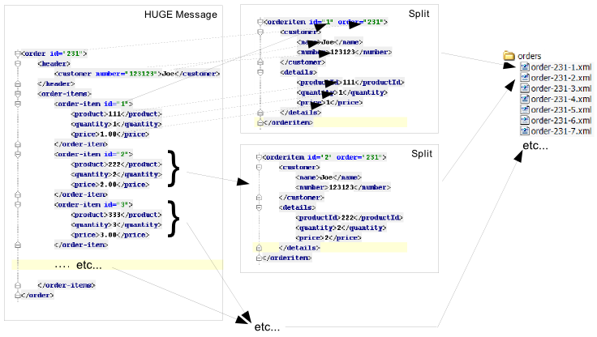

= Smooks Routing Cartridge

image:https://img.shields.io/maven-central/v/org.smooks.cartridges/smooks-routing-cartridge[Maven Central]
image:https://img.shields.io/nexus/s/org.smooks.cartridges/smooks-routing-cartridge?server=https%3A%2F%2Foss.sonatype.org[Sonatype Nexus (Snapshots)]
image:https://github.com/smooks/smooks-routing-cartridge/workflows/CI/badge.svg[Build Status]

// tag::smooks-routing-cartridge[]
A common approach to processing large/huge messages is to split them out into smaller messages that can be processed independently. Of course splitting and routing is not just a solution for processing huge
messages. It's often needed with smaller messages as well (message size may be irrelevant) where, for example, order items in an order message need to be split out and routed (based on content - "Content Base Routing") to different departments or partners for processing. Under these conditions, the message formats required at the different destinations may also vary e.g.,

* "destination1" required XML via the file system,
* "destination2" requires Java objects via a JMS Queue,
* "destination3" picks the messages up from a table in a database, etc...
* "destination4" requires EDI messages via a JMS Queue,
* etc etc

With Smooks, all of the above is possible. You can perform multiple splitting and routing operations to multiple destinations (of different types) in a single pass over a message.

The basic concept is simple. As you stream the message through Smooks:

. Repeatedly create a standalone message (split) for the fragment to be routed.
. Repeatedly bind the split message into the bean context under a unique beanId.
. Repeatedly route the split message to the required endpoint (File, DB, JMS, ESB).

We emphasize "Repeatedly" (above) so as to reinforce the point that these operations happen for each instance of the split message found in the source message e.g. for each in an message.

As for points #1 and #2 above specifically, Smooks offers two approaches to creating the split messages:

. A basic (untransformed/unenriched) fragment split and bind. This is a very simple configuration that simply serializes a message fragment (repeatedly) to its XML form and stores it in the bean context as a String.
. A more complex approach using the Java Binding and Templating Cartridges, where you configure Smooks to extract data from the source message and into the bean context (using configs) and then (optionally) apply templates to create the split messages. This is more complex, but offers the following advantages:
* Allows for transformation of the split fragments i.e. not just XML as with the basic option.
* Allows for enrichment of the message.
* Allows for more complex splits, with the ability to merge data from multiple source fragments into each split message e.g. not just the fragments, but the order info too.
* Allows for splitting and routing of Java Objects as the Split messages (e.g., over JMS).

With the more complex approach outlined above, the key to processing huge messages (not an issue for the more basic approach) is to make sure that you always maintain a small memory footprint. You can do this using the JavaBean Cartridge by making sure you're only binding the most relevant message data (into the bean context) at any one time. In the following sections, the examples are all based on splitting and routing of order-items out of an order message. The solutions shown all work for huge messages because the Smooks JavaBean Cartridge binding configurations are implemented such that the only data held in memory at any given time is the main order details (order header etc...), and the  "current" order item details.

== Basic Splitting and Routing

As stated above, the easiest way to split and route fragments of a message is to use the basic `+<frag:serialize>+` and _<*:router>_ components (`+<jms:router>+`, `+<file:router>+`, etc...) from the Routing Cartridge. The `+<frag:serialize>+` component has its own configuration in the `+https://www.smooks.org/xsd/smooks/fragment-routing-1.5.xsd+` namespace.

The following is an example for serializing the contents of a SOAP message body and storing it in the Bean Context under the beanId of `+soapBody+`:

.smooks-config
[source,xml]
----
<?xml version="1.0"?>
<smooks-resource-list xmlns="https://www.smooks.org/xsd/smooks-2.0.xsd"
                      xmlns:frag="https://www.smooks.org/xsd/smooks/fragment-routing-1.5.xsd">

    <frag:serialize fragment="Envelope/Body" bindTo="soapBody" childContentOnly="true"/>

</smooks-resource-list>
----

Then the Smooks code for executing this:

[source,java]
----
Smooks smooks = new Smooks(configStream);
JavaResult javaResult = new JavaResult();

smooks.filterSource(new StreamSource(soapMessageStream), javaResult);

String bodyContent = javaResult.getBean("soapBody").toString().trim();
----

And of course, you can do all of this programmatically too (i.e., no need for the XML config):

[source,java]
----
Smooks smooks = new Smooks();

smooks.addVisitor(new FragmentSerializer().setBindTo("soapBody"), "Envelope/Body");

JavaResult javaResult = new JavaResult();
smooks.filterSource(new StreamSource(soapMessageStream), javaResult);

String bodyContent = javaResult.getBean("soapBody").toString().trim();
----

The code snippets above only show how to create the split messages and bind them into the bean context, from where they can be accessed. How about routing these split messages to another endpoint for processing?Well it's easy, just use one of the routing components as outlined in the following sections.

The following is a quick example, showing the config for routing split messages (this time fragments) to a JMS Destination for processing:

.smooks-config
[source,xml]
----
<?xml version="1.0"?>
<smooks-resource-list xmlns="https://www.smooks.org/xsd/smooks-2.0.xsd"
                      xmlns:frag="https://www.smooks.org/xsd/smooks/fragment-routing-1.5.xsd" xmlns:jms="https://www.smooks.org/xsd/smooks/jms-routing-2.0.xsd">

    <!-- Create the split messages for the order items... -->
    <frag:serialize fragment="order-items/order-item" bindTo="orderItem" />

    <!-- Route each order items split mesage to the orderItem JMS processing queue... -->
    <jms:router routeOnElement="order-items/order-item" beanId="orderItem" destination="orderItemProcessingQueue" />

</smooks-resource-list>
----

For more details on the JMS routing aspects of the above example, see the JMS Router documentation (below). The <jms:router> could be substituted for any of the other routers e.g. if using with JBoss ESB, you could use the `+<esbr:routeBean>+` configuration to route the split message to any ESB endpoint.

== File

File based routing is performed via the `+<file:outputStream>+` configuration from the
`+https://www.smooks.org/xsd/smooks/file-routing-2.0.xsd+` configuration namespace.

This section illustrates how you can combine the following Smooks functionality to split a message out into smaller messages on the file system.

. The Javabean cartridge for extracting data from the message and holding it in variables in the bean context. In this case, we could also use DOM NodeModels for capturing the order and order-item data to be used as the templating data models.
. The `+<file:outputStream>+` configuration from the routing cartridge for managing file system streams (naming, opening, closing, throttling creation, etc...).
. The templating cartridge (FreeMarker Templates) for generating the individual split messages from data bound in the bean context by the JavaBean cartridge (see #1 above). The templating result is written to the file output stream (#2 above).

In the example, we want to process a huge order message and route the individual order item details to file. The following illustrates what we want to achieve. As you can see, the split messages don't just contain data from the order item fragments. They also contain data from the order header and root elements.

To achieve this with Smooks, we assemble the following Smooks configuration:

.smooks-config.xml
[source,xml]
----
<?xml version="1.0"?>
<smooks-resource-list xmlns="https://www.smooks.org/xsd/smooks-2.0.xsd"
                      xmlns:core="https://www.smooks.org/xsd/smooks/smooks-core-1.6.xsd"
                      xmlns:jb="https://www.smooks.org/xsd/smooks/javabean-1.6.xsd"
                      xmlns:file="https://www.smooks.org/xsd/smooks/file-routing-2.0.xsd"
                      xmlns:ftl="https://www.smooks.org/xsd/smooks/freemarker-2.0.xsd">

        <!-- Extract and decode data from the message. Used in the freemarker template (below).
             Note that we could also use a NodeModel here... -->
(1)     <jb:bean beanId="order" class="java.util.Hashtable" createOnElement="order">
            <jb:value property="orderId" decoder="Integer" data="order/@id"/>
            <jb:value property="customerNumber" decoder="Long" data="header/customer/@number"/>
            <jb:value property="customerName" data="header/customer"/>
            <jb:wiring property="orderItem" beanIdRef="orderItem"/>
        </jb:bean>
(2)     <jb:bean beanId="orderItem" class="java.util.Hashtable" createOnElement="order-item">
            <jb:value property="itemId" decoder="Integer" data="order-item/@id"/>
            <jb:value property="productId" decoder="Long" data="order-item/product"/>
            <jb:value property="quantity" decoder="Integer" data="order-item/quantity"/>
            <jb:value property="price" decoder="Double" data="order-item/price"/>
        </jb:bean>

        <!-- Create/open a file output stream. This is writen to by the freemarker template (below).. -->
(3)     <file:outputStream openOnElement="order-item" resourceName="orderItemSplitStream">
            <file:fileNamePattern>order-${order.orderId}-${order.orderItem.itemId}.xml</file:fileNamePattern>
            <file:destinationDirectoryPattern>target/orders</file:destinationDirectoryPattern>
            <file:listFileNamePattern>order-${order.orderId}.lst</file:listFileNamePattern>

            <file:highWaterMark mark="10"/>
        </file:outputStream>

        <!--
         Every time we hit the end of an <order-item> element, apply this freemarker template,
         outputting the result to the "orderItemSplitStream" OutputStream, which is the file
         output stream configured above.
        -->
(4)     <ftl:freemarker applyOnElement="order-item">
            <ftl:template>target/classes/orderitem-split.ftl</ftl:template>
            <ftl:use>
                <!-- Output the templating result to the "orderItemSplitStream" file output stream... -->
                <ftl:outputTo outputStreamResource="orderItemSplitStream"/>
            </ftl:use>
        </ftl:freemarker>

</smooks-resource-list>
----

Smooks Resource configuration #1 and #2 define the Java Bindings for extracting the order header information (config #1) and the order-item information (config #2). This is the key to processing a huge message; making sure that we only have the current order item in memory at any one time. The Smooks Javabean Cartridge manages all this for you, creating and recreating the orderItem beans as the fragments are being processed.

The `+<file:outputStream>+` configuration in configuration #3 manages the generation of the files on the file system. As you can see from the configuration, the file names can be dynamically constructed from data in the bean context. You can also see that it can throttle the creation of the files via the `+highWaterMark+` configuration parameter. This helps you manage file creation so as not to overwhelm the target file system.

Smooks Resource configuration #4 defines the FreeMarker templating resource used to write the split messages to the OutputStream created by the `+file:outputStream+` (config #3). See how config #4 references the `+file:outputStream+` resource. The Freemarker template is as follows:

[source]
----
<orderitem id="${.vars["order-item"].@id}" order="${order.@id}">
    <customer>
        <name>${order.header.customer}</name>
        <number>${order.header.customer.@number}</number>
    </customer>
    

        <productId>${.vars["order-item"].product}</productId>
        <quantity>${.vars["order-item"].quantity}</quantity>
        <price>${.vars["order-item"].price}</price>
    

</orderitem>
----

== JMS

JMS routing is performed via the `+<jms:router>+` configuration from the `+https://www.smooks.org/xsd/smooks/jms-routing-2.0.xsd+` configuration namespace.

The following is an example `+<jms:router>+` configuration that routes an `+orderItem_xml+` bean to a JMS Queue named `+smooks.exampleQueue+` (also read the "Routing to File" example):

.smooks-config.xml
[source,xml]
----
<?xml version="1.0"?>
<smooks-resource-list xmlns="https://www.smooks.org/xsd/smooks-2.0.xsd"
                      xmlns:core="https://www.smooks.org/xsd/smooks/smooks-core-1.6.xsd"
                      xmlns:jms="https://www.smooks.org/xsd/smooks/jms-routing-2.0.xsd"
                      xmlns:ftl="https://www.smooks.org/xsd/smooks/freemarker-2.0.xsd">

(1)     <resource-config selector="order,order-item">
            <resource>org.smooks.engine.resource.visitor.dom.DomModelCreator</resource>
        </resource-config>

(2)     <jms:router routeOnElement="order-item" beanId="orderItem_xml" destination="smooks.exampleQueue">
            <jms:message>
                <!-- Need to use special FreeMarker variable ".vars" -->
                <jms:correlationIdPattern>${order.@id}-${.vars["order-item"].@id}</jms:correlationIdPattern>
            </jms:message>
            <jms:highWaterMark mark="3"/>
        </jms:router>

(3)     <ftl:freemarker applyOnElement="order-item">
            <!--
             Note in the template that we need to use the special FreeMarker variable ".vars"
             because of the hyphenated variable names ("order-item"). See http://freemarker.org/docs/ref_specvar.html.
            -->
            <ftl:template>/orderitem-split.ftl</ftl:template>
            <ftl:use>
                <!-- Bind the templating result into the bean context, from where
                     it can be accessed by the JMSRouter (configured above). -->
                <ftl:bindTo id="orderItem_xml"/>
            </ftl:use>
        </ftl:freemarker>

</smooks-resource-list>
----

In this case, we route the result of a FreeMarker templating operation to the JMS Queue (i.e. as a String). We could also have routed a full Object Model, in which case it would be routed as a Serialized ObjectMessage.
// end::smooks-routing-cartridge[]

== Requirements

* Java 11 or higher

== Maven Coordinates

.pom.xml
[source,xml]
----
<dependency>
    <groupId>org.smooks.cartridges</groupId>
    <artifactId>smooks-routing-cartridge</artifactId>
    <version>2.0.0-RC3</version>
</dependency>
----

== License

Smooks Routing Cartridge is open source and licensed under the terms of the Apache License Version 2.0, or the GNU Lesser General Public License version 3.0 or later. You may use Smooks Routing Cartridge according to either of these licenses as is most appropriate for your project.

`+SPDX-License-Identifier: Apache-2.0 OR LGPL-3.0-or-later+`
